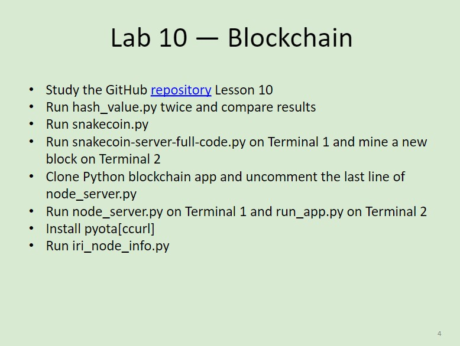
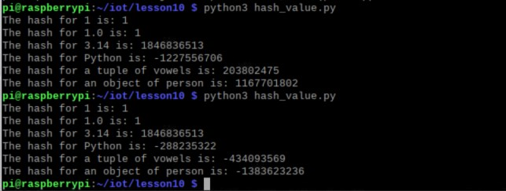
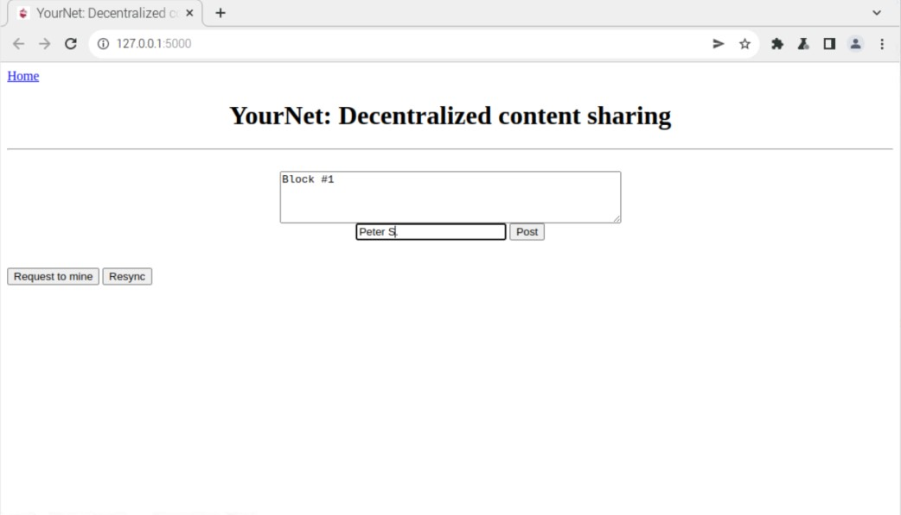
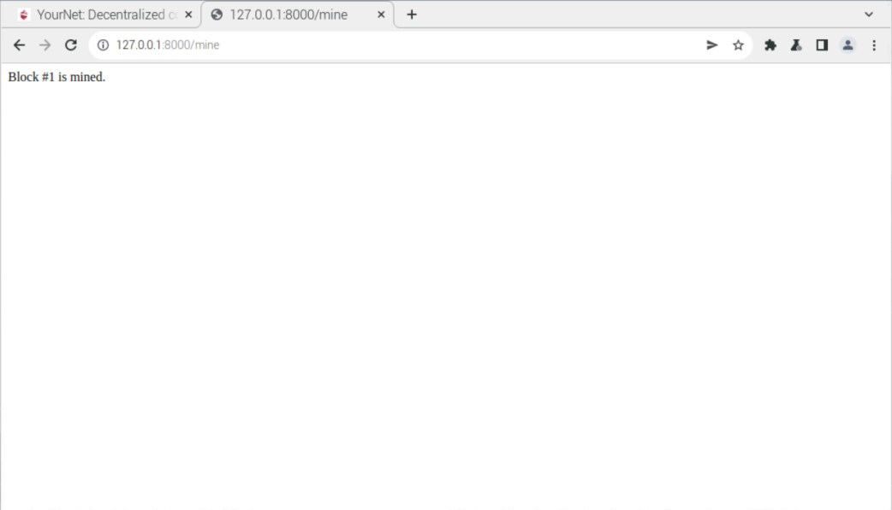
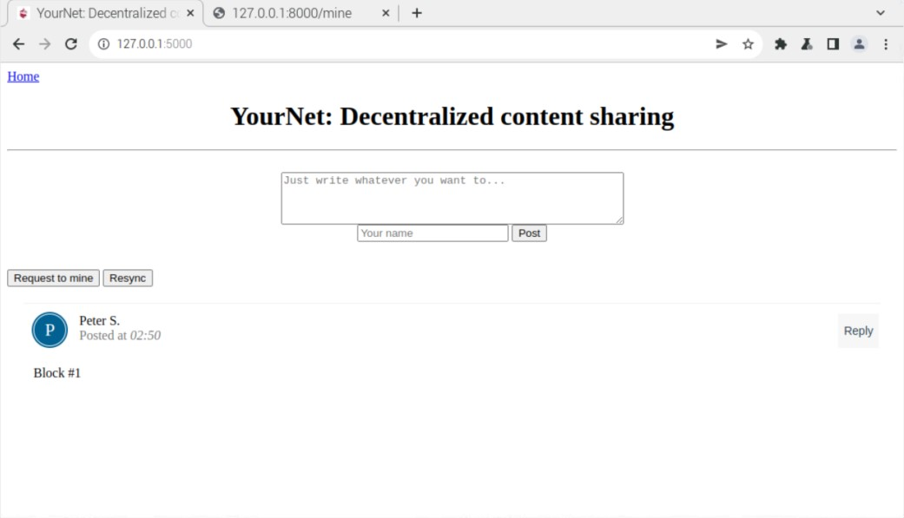
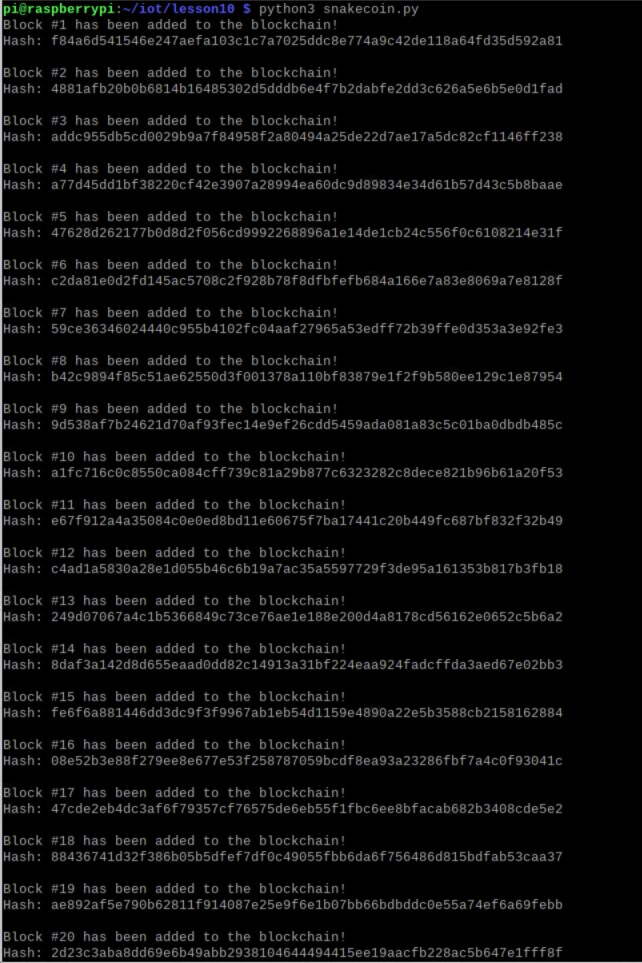
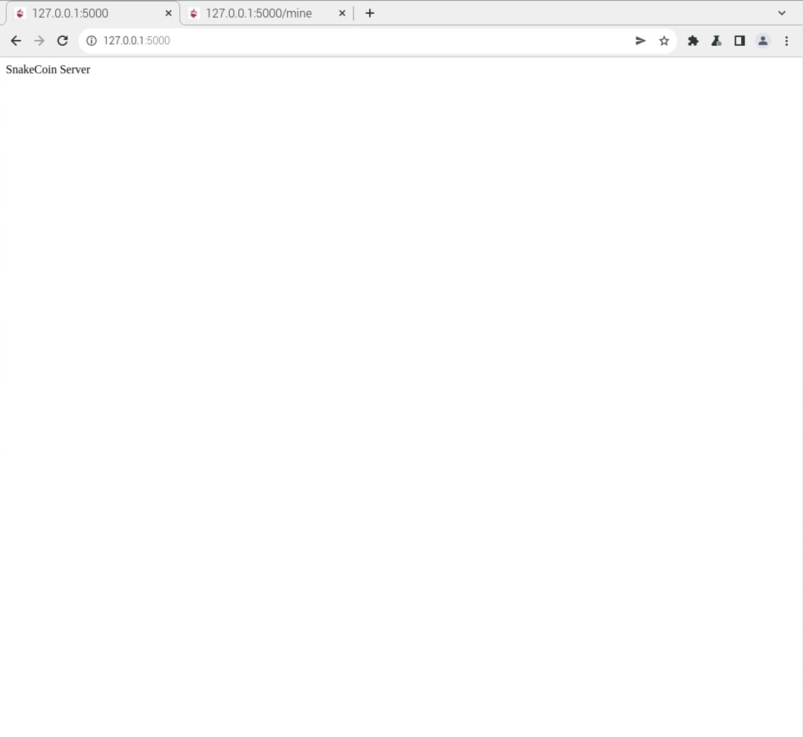
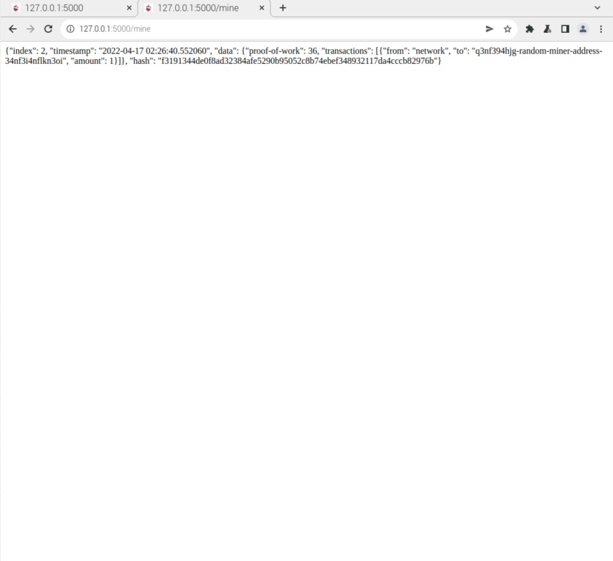
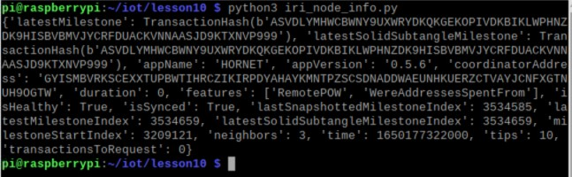

# Labs 10 - Blockchain
I pledge my honor that I have abided by the Stevens Honor System.
Commands were preformed on my Raspberry Pi 4.

## Assignment

## hash_value.py

## node_server.py & run_app.py

## snakecoin.py

## snakecoin-server-full-code.py

## iri_node_info.py

