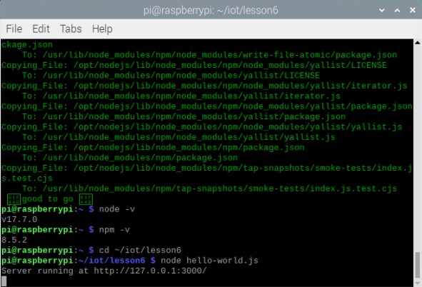
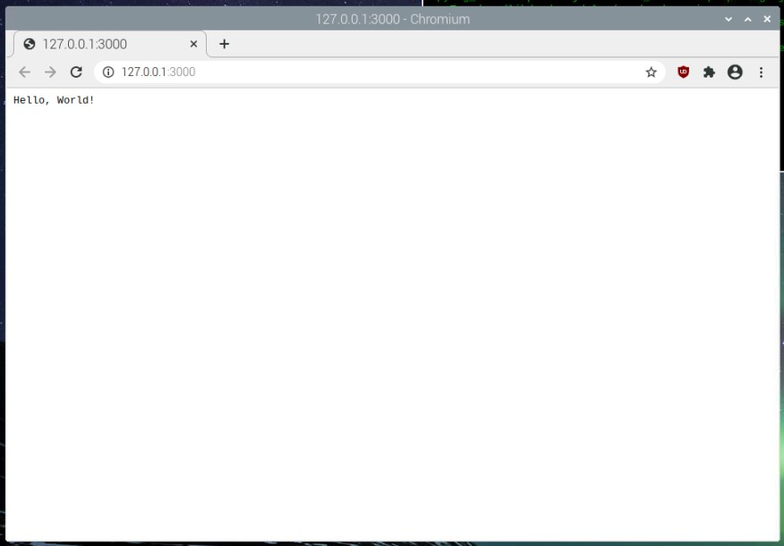
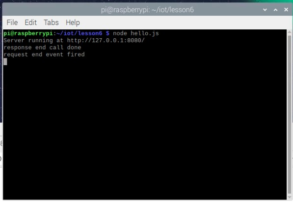
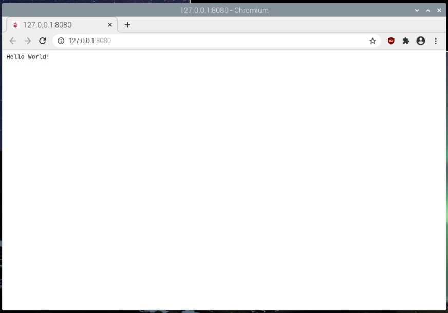
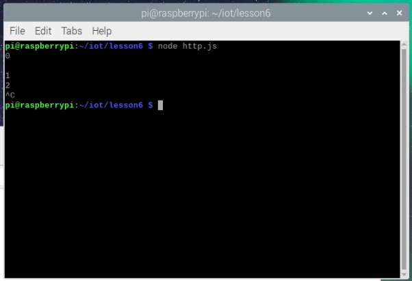
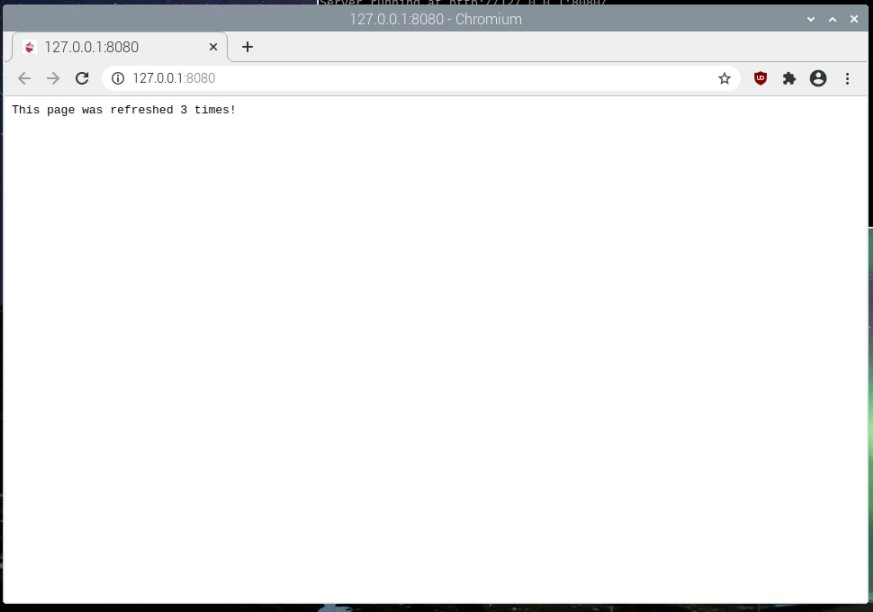
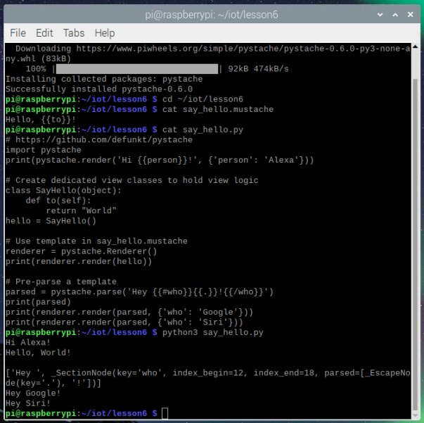

# Labs 6 - Node.js and Pystache
I pledge my honor that I have abided by the Stevens Honor System.
Commands were preformed on my Raspberry Pi 4.

## Assignment

## hello-world.js

## hello.js

## http.js

## say_hello.py.jpg

