# Labs 1 and 2 - Command Line
I pledge my honor that I have abided by the Stevens Honor System.
Commands were preformed on my computer.

## Assignment

### **hostname**
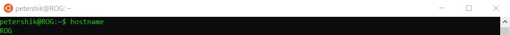

### **env**
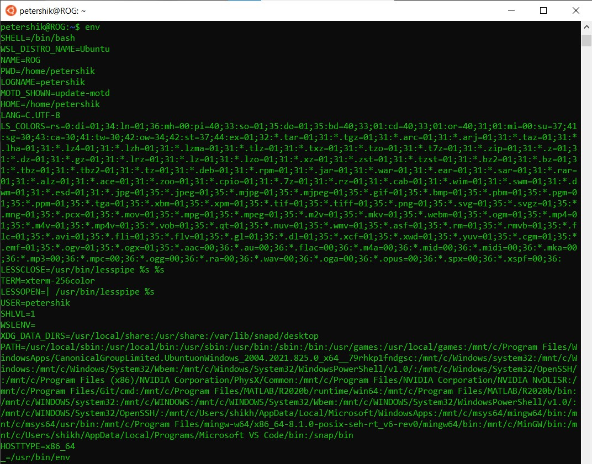

### **ps**
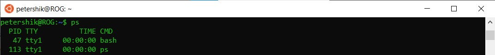

### **pwd**
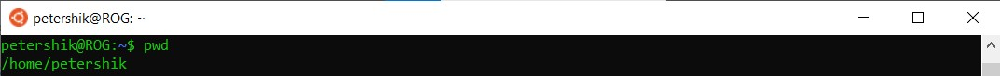

### **git clone**
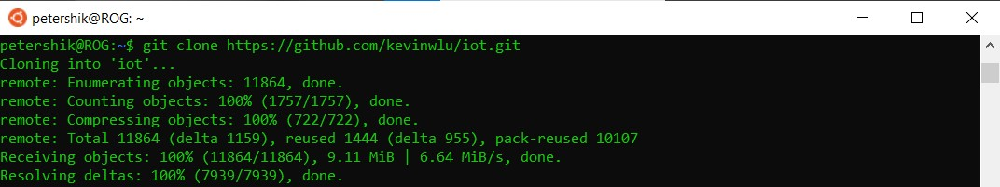

### **cd iot/ls/cd**
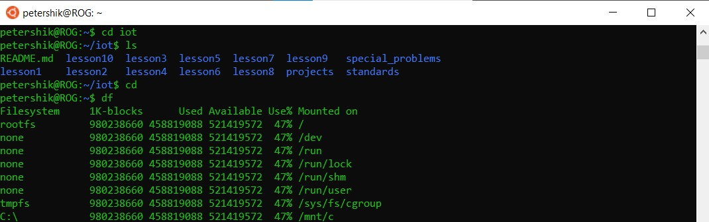

### **df**
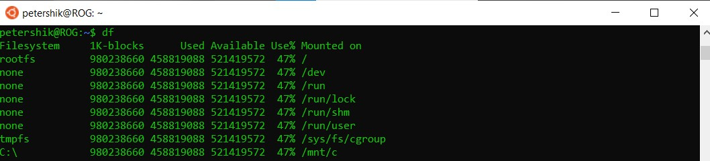

### **mkdir demo/cd demo**
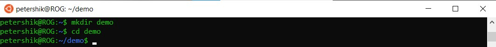

### **nano file**
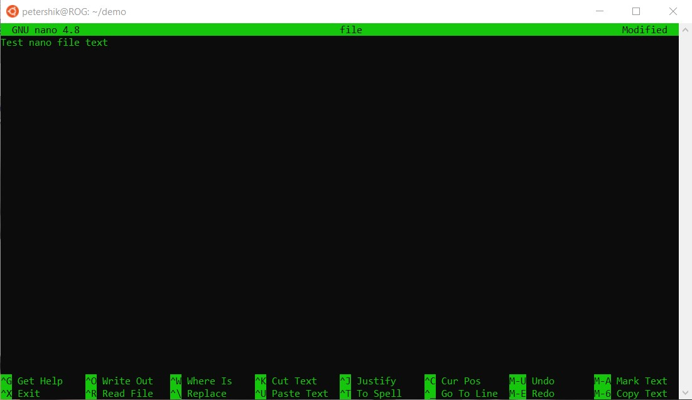

### **catfile**
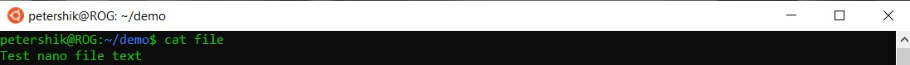

### **cp file file1/mv file file2/rm file2**
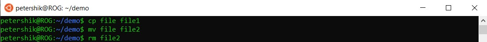

### **clear**
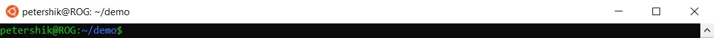

### **man uname**
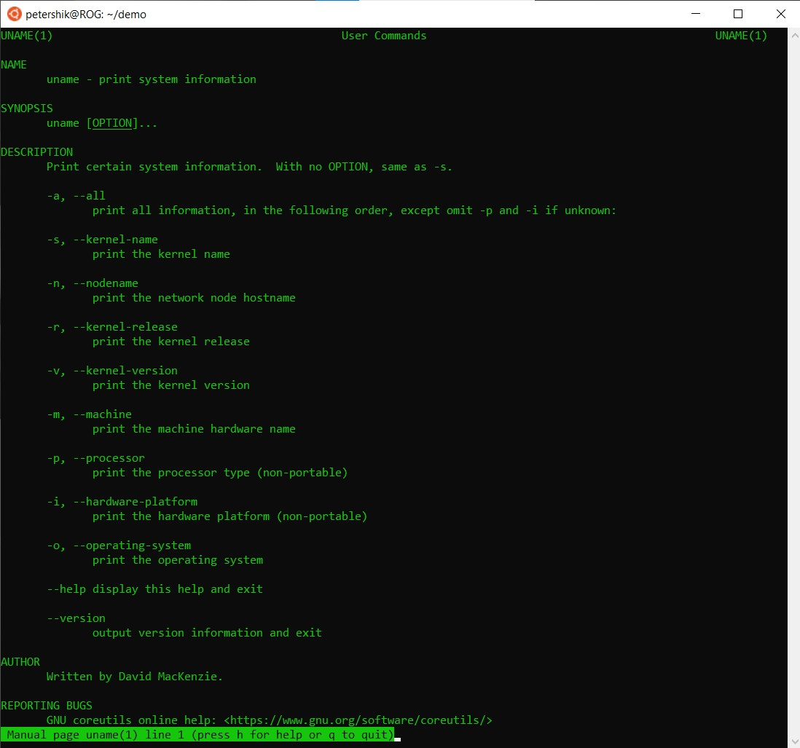

### **uname -a**
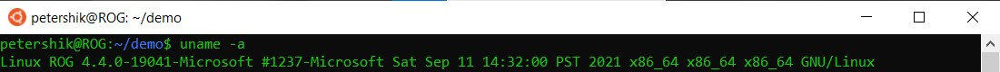

### **ifconfig**
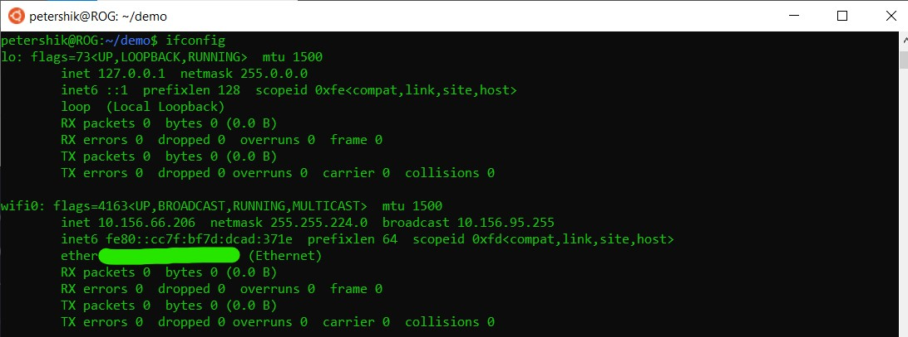

### **ping localhost**
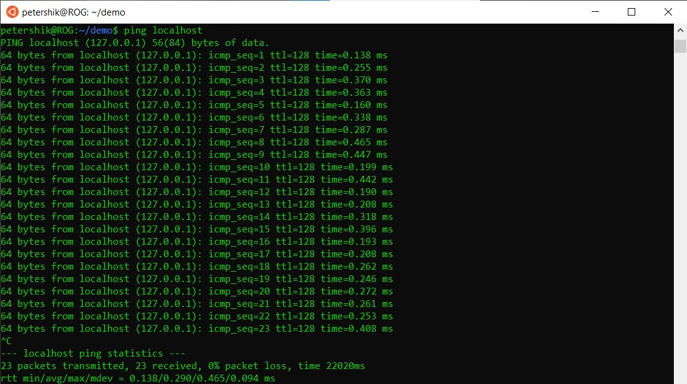

### **netstat**
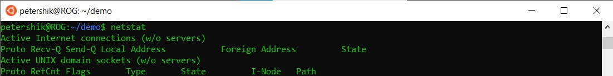
